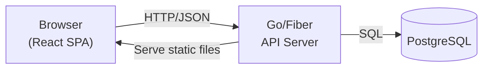
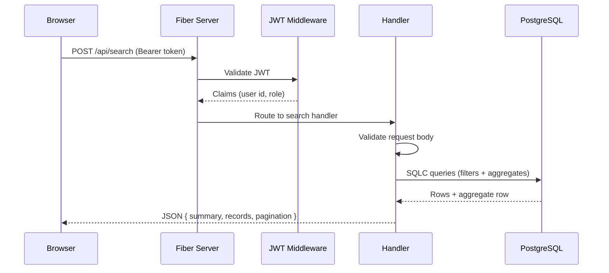

# Design Document: Molikule Supply Chain Analytics Dashboard

## Overview

Molikule is a proof-of-concept internal supply chain analytics dashboard deployed on a company LAN. It lets authenticated employees search purchasing records and view aggregated analytics without any internet dependency.

The system is composed of two independently deployable pieces: a Go/Fiber HTTP API backend and a React/TypeScript/Vite single-page application frontend. The PostgreSQL database is pre-populated externally before the application starts; Molikule has no responsibility for data ingestion.

**Core design philosophy:** Keep it simple and flat. Backend handlers should be readable by a developer unfamiliar with Go. No service-layer indirection, no enterprise patterns, no unnecessary abstractions. A handler file should show — without jumping between files — what the endpoint does: validate input, run a SQL query, return JSON.

### Tech Stack

| Layer | Technology |
|-------|-----------|
| Backend language | Go 1.24+ |
| HTTP framework | Fiber v2 |
| Database | PostgreSQL |
| DB access | SQLC (code-generated, parameterised queries) |
| Auth tokens | JWT (golang-jwt/jwt v5) |
| Password hashing | bcrypt (golang.org/x/crypto) |
| Frontend language | TypeScript |
| Frontend build | Vite |
| UI framework | React 18 |
| Server-state | TanStack Query v5 |
| Table | TanStack Table v8 |
| HTTP client | Axios (or native fetch) |

---

## Architecture

The system is a straightforward three-tier application: browser → API server → database. There are no message queues, background workers, caches, or external services.



The Fiber server serves the compiled frontend static assets and exposes all API routes under `/api/`. On the LAN, the single binary plus the frontend `dist/` folder (or embedded into the binary with Go's `embed` package) is all that is needed to run.

### Request Flow



---

## Components and Interfaces

### Backend Components

The backend uses a **flat package layout** inside `internal/`. Each package is a single layer of concern with no nested sub-services.

```
backend/
├── cmd/server/
│   └── main.go               # Entry point: config, DB, routes, listen
├── internal/
│   ├── config/
│   │   └── config.go         # Load env vars into a Config struct
│   ├── db/
│   │   └── db.go             # Open pgx connection pool
│   ├── middleware/
│   │   └── auth.go           # JWT parse/validate middleware + role guard
│   ├── auth/
│   │   └── handler.go        # POST /api/auth/login, POST /api/auth/change-password
│   ├── users/
│   │   └── handler.go        # GET/POST /api/users, PUT/DELETE /api/users/:id
│   ├── search/
│   │   └── handler.go        # POST /api/search
│   └── models/
│       └── models.go         # Shared response types (ErrorResponse, etc.)
├── sql/
│   ├── migrations/
│   │   └── 001_initial.sql   # Schema + indexes
│   └── queries/
│       ├── auth.sql          # Login, change password queries
│       ├── users.sql         # User CRUD queries
│       ├── search.sql        # Purchase record filter + pagination queries
│       ├── counts.sql        # COUNT queries for pagination
│       └── summary.sql       # Aggregate summary queries
├── db/                       # SQLC-generated Go code (do not edit by hand)
│   ├── db.go
│   ├── models.go
│   └── query.sql.go
└── sqlc.yaml
```

**Key principle:** Each handler file is self-contained. It imports the SQLC-generated `db` package directly, calls query functions, and returns JSON. There is no intermediate "service" or "repository" layer.

### Handler Signature Pattern

Every handler follows the same simple pattern:

```go
func LoginHandler(queries *db.Queries, jwtSecret string) fiber.Handler {
    return func(c *fiber.Ctx) error {
        // 1. Parse and validate request body
        // 2. Call SQLC query function(s)
        // 3. Apply business logic (e.g. bcrypt compare)
        // 4. Return JSON response
    }
}
```

Handlers receive their dependencies (SQLC queries object, config values) as constructor arguments — no global state, no dependency injection frameworks.

### API Endpoints

| Method | Path | Auth Required | Role |
|--------|------|---------------|------|
| POST | `/api/auth/login` | No | — |
| POST | `/api/auth/change-password` | Yes | user, admin |
| GET | `/api/users` | Yes | admin |
| POST | `/api/users` | Yes | admin |
| PUT | `/api/users/:id/password` | Yes | admin |
| DELETE | `/api/users/:id` | Yes | admin |
| POST | `/api/search` | Yes | user, admin |

### Middleware

`internal/middleware/auth.go` contains two functions:

- **`RequireAuth`** — parses the `Authorization: Bearer <token>` header, validates the JWT signature and expiry, and stores claims in `c.Locals`. Returns 401 if token is missing or invalid.
- **`RequireRole(role string)`** — reads claims from `c.Locals`, checks the role field matches. Returns 403 if it doesn't. Applied after `RequireAuth`.

### Frontend Components

```
frontend/src/
├── pages/
│   ├── Login.tsx
│   ├── Dashboard.tsx
│   └── UserManagement.tsx
├── components/
│   ├── ProtectedRoute.tsx    # Redirect to /login if not authenticated
│   ├── Navbar.tsx            # User name, role, logout button
│   ├── SearchForm.tsx        # Filter inputs with client-side validation
│   ├── SummaryCard.tsx       # Aggregated metrics display
│   └── ResultsTable.tsx      # TanStack Table with sort + pagination
├── api/
│   └── client.ts             # Axios instance with auth header injection
├── services/
│   ├── auth.ts               # Login, change-password API calls
│   ├── search.ts             # Search API call
│   └── users.ts              # User management API calls
├── hooks/
│   └── useAuth.ts            # Auth state (JWT, user info) from localStorage
├── types/
│   └── index.ts              # TypeScript types for API requests/responses
└── main.tsx
```

---

## Data Models

### Database Schema

```sql
-- purchase_records (pre-populated, read-only from Molikule's perspective)
CREATE TABLE purchase_records (
    id              BIGSERIAL PRIMARY KEY,
    plant_code      VARCHAR(4)     NOT NULL,
    material_code   VARCHAR(8)     NOT NULL,
    vendor_code     VARCHAR(8)     NOT NULL,
    description     TEXT,
    purchase_no     VARCHAR(10),
    purchase_date   DATE           NOT NULL,
    net_price       NUMERIC(15,2),
    cost            NUMERIC(15,2),
    supplying_plant TEXT,
    quantity        NUMERIC(15,2),
    currency        VARCHAR(10),
    unit            VARCHAR(20)
);

-- Indexes for search performance (300,000 rows)
CREATE INDEX idx_pr_material_code  ON purchase_records (material_code);
CREATE INDEX idx_pr_vendor_code    ON purchase_records (vendor_code);
CREATE INDEX idx_pr_plant_code     ON purchase_records (plant_code);
CREATE INDEX idx_pr_purchase_date  ON purchase_records (purchase_date);
CREATE INDEX idx_pr_mat_ven        ON purchase_records (material_code, vendor_code);
CREATE INDEX idx_pr_mat_plant      ON purchase_records (material_code, plant_code);
CREATE INDEX idx_pr_ven_plant      ON purchase_records (vendor_code, plant_code);

-- users (managed by Molikule)
CREATE TABLE users (
    id            BIGSERIAL PRIMARY KEY,
    employee_id   VARCHAR(6)   UNIQUE NOT NULL,
    name          VARCHAR(255),
    password_hash TEXT         NOT NULL,
    role          VARCHAR(20)  NOT NULL,
    created_at    TIMESTAMP    DEFAULT NOW(),
    updated_at    TIMESTAMP    DEFAULT NOW()
);
```

### SQLC Query Organization

`backend/sqlc.yaml` references five query files:

- **auth.sql** — `GetUserByEmployeeID`, `UpdatePasswordHash`
- **users.sql** — `ListUsers`, `CreateUser`, `DeleteUser`, `GetUserByID`, `UpdateUserPasswordHash`
- **search.sql** — Dynamic search queries for all filter combinations with LIMIT/OFFSET pagination
- **counts.sql** — COUNT(*) queries matching the search filters (for pagination metadata)
- **summary.sql** — Aggregate queries: SUM, AVG, MIN, MAX, COUNT DISTINCT for each filter combination

### API Request/Response Types

**Login request:**
```json
{ "employee_id": "123456", "password": "secret" }
```

**Login response:**
```json
{ "token": "<jwt>", "user": { "id": 1, "employee_id": "123456", "name": "Jane Smith", "role": "user" } }
```

**Search request:**
```json
{
  "material_code": "12345678",
  "vendor_code": null,
  "plant_code": null,
  "start_date": "2024-01-01",
  "end_date": "2024-12-31",
  "page": 1,
  "page_size": 50,
  "sort_by": "purchase_date",
  "sort_order": "desc"
}
```

**Search response:**
```json
{
  "summary": {
    "records_found": 1240,
    "total_cost": 580000.00,
    "avg_cost": 467.74,
    "avg_net_price": 440.00,
    "min_cost": 12.50,
    "max_cost": 9800.00,
    "purchase_order_count": 87,
    "earliest_date": "2024-01-05",
    "latest_date": "2024-11-30",
    "currencies": ["EUR", "USD"],
    "units": ["KG", "PC"],
    "material_summary": null,
    "vendor_summary": null,
    "plant_summary": null
  },
  "records": [ /* array of purchase record objects */ ],
  "pagination": {
    "page": 1,
    "page_size": 50,
    "total_records": 1240,
    "total_pages": 25
  }
}
```

**Error response (all errors):**
```json
{ "error": "VALIDATION_ERROR", "message": "material_code must be exactly 8 numeric digits" }
```

### JWT Claims

```json
{
  "sub": "1",
  "employee_id": "123456",
  "name": "Jane Smith",
  "role": "user",
  "exp": 1700000000,
  "iat": 1699996400
}
```

JWT expiry: 8 hours (a working day). No refresh token — employees log in at the start of their shift.

### TypeScript Types (frontend/src/types/index.ts)

```typescript
export interface User {
  id: number;
  employee_id: string;
  name: string;
  role: "user" | "admin";
}

export interface AuthState {
  token: string;
  user: User;
}

export interface SearchRequest {
  material_code?: string;
  vendor_code?: string;
  plant_code?: string;
  start_date?: string;
  end_date?: string;
  page: number;
  page_size: number;
  sort_by?: "purchase_date" | "cost" | "net_price";
  sort_order?: "asc" | "desc";
}

export interface PurchaseRecord {
  id: number;
  plant_code: string;
  material_code: string;
  vendor_code: string;
  description: string | null;
  purchase_no: string | null;
  purchase_date: string;
  net_price: number | null;
  cost: number | null;
  supplying_plant: string | null;
  quantity: number | null;
  currency: string | null;
  unit: string | null;
}

export interface VendorSummary {
  vendor_code: string;
  avg_cost: number;
  avg_net_price: number;
  last_purchase_cost: number | null;
  cheapest_cost: number | null;
  materials_count: number;
  plants_count: number;
  purchase_order_count: number;
  currencies: string[];
  units: string[];
  first_date: string;
  last_date: string;
}

export interface MaterialSummary {
  material_code: string;
  description: string | null;
  avg_cost: number;
  avg_net_price: number;
  last_purchase_cost: number | null;
  cheapest_cost: number | null;
  vendor_count: number;
  plant_count: number;
  purchase_order_count: number;
  currencies: string[];
  units: string[];
  first_date: string;
  last_date: string;
}

export interface PlantSummary {
  plant_code: string;
  avg_cost: number;
  avg_net_price: number;
  last_purchase_cost: number | null;
  cheapest_cost: number | null;
  vendor_count: number;
  material_count: number;
  purchase_order_count: number;
  currencies: string[];
  units: string[];
  first_date: string;
  last_date: string;
}

export interface SearchSummary {
  records_found: number;
  total_cost: number;
  avg_cost: number;
  avg_net_price: number;
  min_cost: number | null;
  max_cost: number | null;
  purchase_order_count: number;
  earliest_date: string | null;
  latest_date: string | null;
  currencies: string[];
  units: string[];
  vendor_summary: VendorSummary | null;
  material_summary: MaterialSummary | null;
  plant_summary: PlantSummary | null;
}

export interface Pagination {
  page: number;
  page_size: number;
  total_records: number;
  total_pages: number;
}

export interface SearchResponse {
  summary: SearchSummary | null;
  records: PurchaseRecord[];
  pagination: Pagination;
}
```

---

## Error Handling

### Backend Error Strategy

All handlers follow a consistent error response pattern. There are no panics in handler code — all errors are returned as JSON.

```go
// Standard error response helper in internal/models/models.go
type ErrorResponse struct {
    Error   string `json:"error"`   // machine-readable code, e.g. "VALIDATION_ERROR"
    Message string `json:"message"` // human-readable description
}

func SendError(c *fiber.Ctx, status int, code, msg string) error {
    return c.Status(status).JSON(ErrorResponse{Error: code, Message: msg})
}
```

| Scenario | HTTP Status | Error Code |
|----------|-------------|------------|
| Invalid request body (JSON parse) | 400 | `BAD_REQUEST` |
| Validation failure (field format) | 400 | `VALIDATION_ERROR` |
| Invalid/missing credentials | 401 | `UNAUTHORIZED` |
| Missing or invalid JWT | 401 | `UNAUTHORIZED` |
| Insufficient role | 403 | `FORBIDDEN` |
| Resource not found | 404 | `NOT_FOUND` |
| Duplicate resource | 409 | `CONFLICT` |
| Unhandled internal error | 500 | `INTERNAL_ERROR` |

The Fiber app is configured with a global error handler that catches any unhandled errors, logs them server-side with `log/slog`, and returns a generic 500 response. Database errors are never forwarded to the client.

### Validation

Input validation is performed in the handler before any database call. SQLC does not perform validation — all checks happen at the Go level:

- Employee_ID: regexp `^\d{6}$`
- Material_Code: regexp `^\d{8}$`
- Vendor_Code: regexp `^\d{8}$`
- Plant_Code: regexp `^[a-zA-Z0-9]{4}$`
- At least one of material_code, vendor_code, plant_code must be provided in a search request
- Page must be ≥ 1; page_size must be between 1 and 200
- sort_by must be one of: `purchase_date`, `cost`, `net_price`; sort_order must be `asc` or `desc`

### Frontend Error Handling

TanStack Query's `isError` and `error` states are used to display error messages from the backend. The frontend displays the `message` field from the error response. Components use error boundaries to prevent full-page crashes from unexpected errors.
